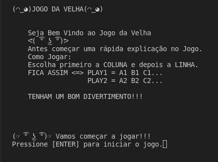

# JOGO DA VELHA

<div style="display: inline_block"><br>

</div>
## 💻 Pré-requisitos

Antes de começar:
* Clone o repositório

* Instale a versão mais recente do [Node](https://nodejs.org/en/).


## 🚀 Instalando o Jogo 

Para instalar o Jogo, siga estas etapas:

* Através do Terminal no VSCODE use os seguintes comandos nos sistemas:

Linux ou Windows

```
npm init -y
```

```
npm i prompt-sync
```
> Projeto Jogo da Velha realizando durante os estudos na Blue EdTech.